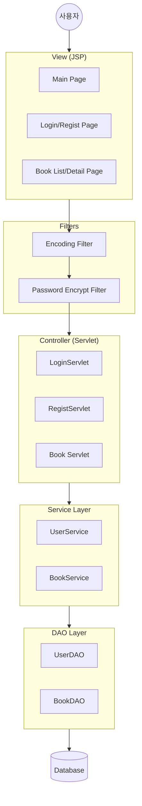
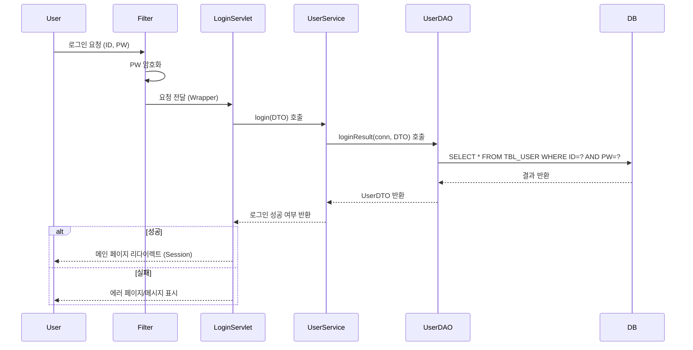
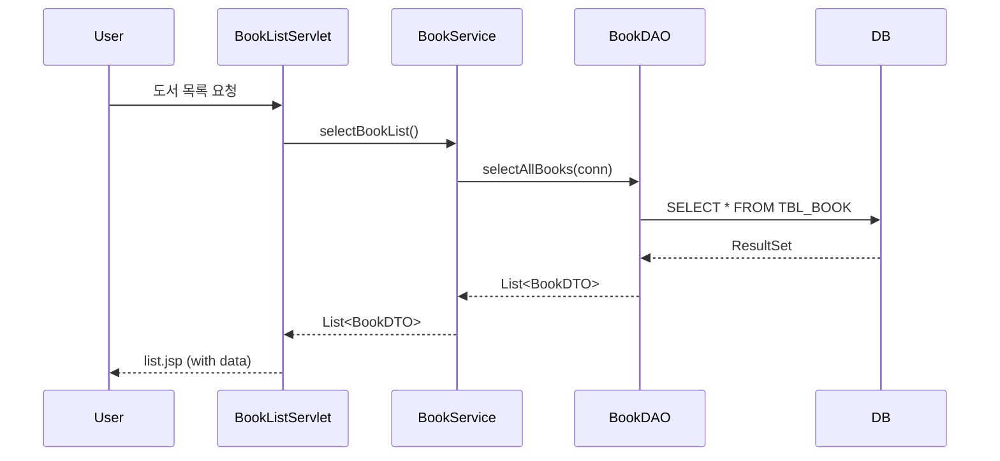
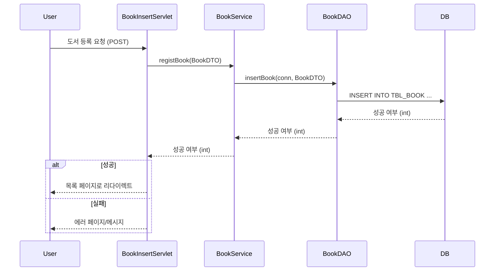
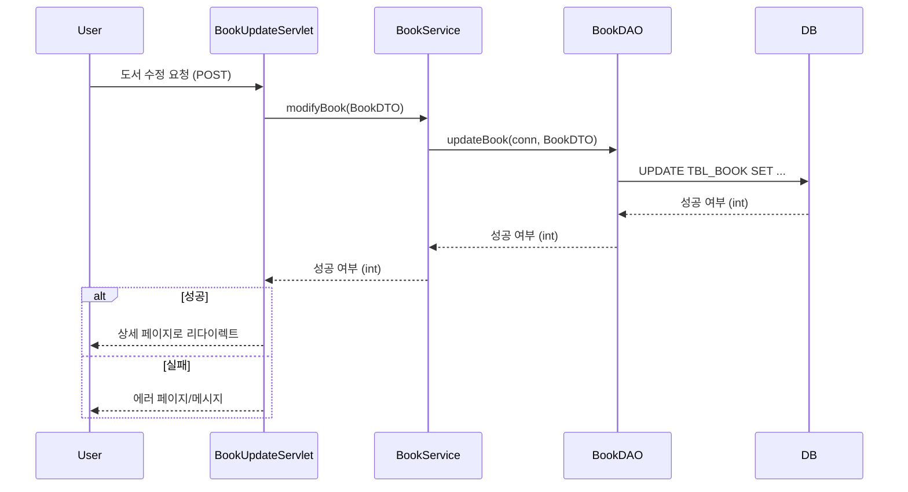
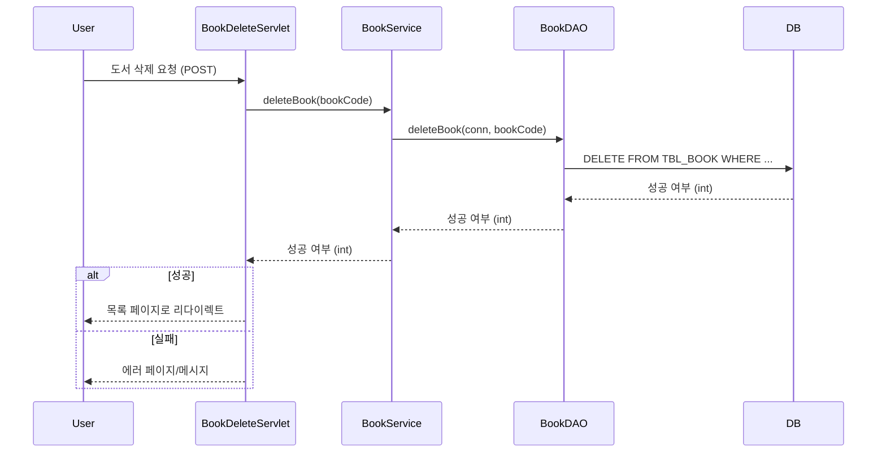

# jdbc_project_4team
사이드 프로젝트_4팀

# 프로젝트 구조 및 기능 정리

## 1. 프로젝트 구조 (Project Structure)

### 1.1 Java Source (`src/main/java`)

*   **`com.ohgiraffers.controller`**: 사용자 요청을 처리하는 서블릿 클래스
    *   **인증 관리**: `LoginServlet` (로그인), `RegistServlet` (회원가입), `DBResetServlet` (DB 초기화)
    *   **도서 관리**: `BookListServlet` (목록), `BookDetailServlet` (상세), `BookInsertServlet` (등록), `BookUpdateServlet` (수정), `BookDeleteServlet` (삭제)
*   **`com.ohgiraffers.service`**: 트랜잭션 및 비즈니스 로직 처리
    *   `UserService`: 회원 로그인, 가입 처리
    *   `BookService`: 도서 CRUD 로직
    *   `RecommendationService`: 시간대별 추천 도서 로직
*   **`com.ohgiraffers.dao`**: 데이터베이스 접근 객체 (Data Access Object)
    *   `UserDAO`: 회원 테이블 쿼리 실행
    *   `BookDAO`: 도서 테이블 쿼리 실행
*   **`com.ohgiraffers.dto`**: 데이터 전송 객체 (Data Transfer Object)
    *   `UserDTO`, `BookDTO`
*   **`com.ohgiraffers.common`**: 유틸리티
    *   `JDBCTemplate`: Connection 관리 (`commit`, `rollback`, `close`)
    *   `HangulUtils`: 한글 처리 도구
*   **`com.ohgiraffers.filter`**: 요청/응답 필터링
    *   `CharacterEncodingFilter`: UTF-8 인코딩 설정
    *   `PasswordEncryptFilter`: 비밀번호 암호화 처리 (Wrapper 사용)
    *   `PasswordRequestWrapper`: 암호화된 비밀번호를 요청에 래핑

### 1.2 Web Resources (`src/main/webapp`)

*   **Views (`/WEB-INF/views` & root)**:
    *   `index.jsp`: 메인 페이지 (추천 도서 노출)
    *   `regist.jsp`: 회원가입 폼
    *   `book/`: `list.jsp` (목록), `detail.jsp` (상세/수정/삭제)
*   **Config**: `WEB-INF/web.xml`, `resources/connection-info.properties`
*   **Static**: `resources/css`, `resources/images`, `resources/js`

## 2. 주요 기능 및 흐름 (Key Functions & Flow)

### 2.1 사용자 관리 (User Management)
*   **로그인**: ID/PW 입력 -> 필터에서 암호화 -> DB 비교 -> 세션 생성
*   **회원가입**: 정보 입력 -> 필터에서 암호화 -> DB 저장

### 2.2 도서 관리 (Book Management)
*   **목록 조회**: 전체 도서 목록 페이징/검색 조회
*   **상세 조회**: 특정 도서의 상세 정보 확인
*   **도서 등록/수정/삭제**: 관리자(또는 권한 있는 사용자) 기능

### 2.3 기타
*   **추천 서비스**: 매 시 정각마다 추천 도서 변경 로직 (`RecommendationService`)
*   **DB 리셋**: 초기 데이터로 복구 기능 제공

---

## 3. 시스템 흐름도 (System Flow Chart)

### 전체 아키텍처 흐름 (Architecture Flow)

### 상세 기능 프로세스 (Detailed Process)

#### 로그인 프로세스 (Login Process)

#### 도서 목록 조회 프로세스 (Book List Process)

#### 도서 등록/수정/삭제 프로세스 (Book CRUD Process)

**1. 도서 등록 (Insert)**

**2. 도서 수정 (Update)**

**3. 도서 삭제 (Delete)**

